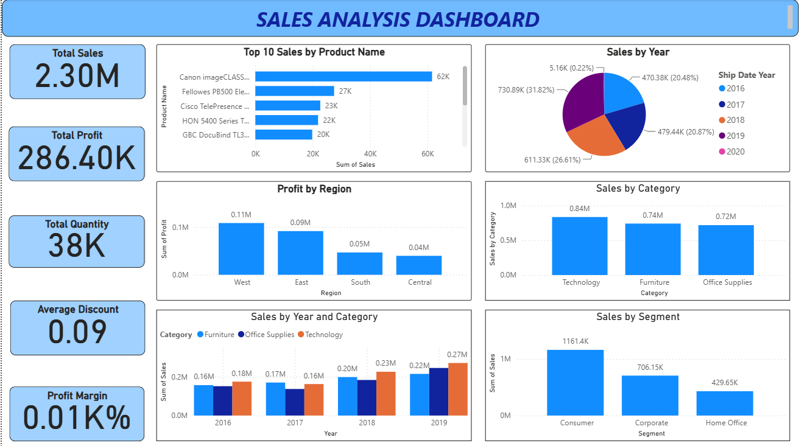

# 📊 Sales Performance Analysis Dashboard

A Power BI dashboard that analyzes sales performance across products, customers, regions, and time. The project leverages Power Query for data transformation, DAX for KPI calculations, and interactive visualizations to uncover business insights that support data-driven decision-making.

---

# 📌 Project Overview

This project analyzes company sales data using Microsoft Power BI to evaluate sales performance, profitability, customer behavior, product performance, and regional trends.

The dataset spans **2016–2019** and contains information about orders, customers, products, categories, discounts, profits, shipping modes, and sales. After cleaning and transforming the data, an interactive dashboard was developed to monitor key business metrics and identify opportunities for growth.

---

# 📷 Dashboard Preview

---

# 🎯 Project Objectives

- Analyze overall sales performance.
- Evaluate profit and sales trends over time.
- Identify top-performing products and customers.
- Compare regional sales and profitability.
- Understand the impact of discounts on profitability.
- Build an interactive dashboard to support business decision-making.

---

# 📂 Dataset Information

The dataset contains order-level sales information from **2016–2019**, including:

- Order ID
- Order Date
- Customer Name
- Product Name
- Category & Sub-Category
- Region
- Segment
- Sales
- Profit
- Quantity
- Discount
- Shipping Mode

---

# 🛠️ Tools & Technologies Used

- Microsoft Power BI
- Power Query
- DAX (Data Analysis Expressions)
- Data Modeling
- Interactive Dashboards

---

# ⚙️ Data Preparation

The dataset was prepared using Power Query before visualization.

### Data Cleaning & Transformation

- Removed duplicate records using **Order ID**.
- Extracted **Year** from the Order Date.
- Created a filtered dataset for **2019**.
- Filtered orders with discounts.
- Grouped yearly sales data.
- Built DAX measures for key performance indicators.

---

# 📊 DAX Measures Created

Some of the calculated measures include:

- Total Sales
- Total Profit
- Total Quantity
- Average Sales
- Average Profit
- Average Discount
- Profit Margin
- Sales after Removing Duplicates

---

# 📈 Dashboard Features

The dashboard provides insights into:

### Sales Performance

- Total Sales
- Total Profit
- Total Quantity
- Profit Margin
- Average Discount

### Product Analysis

- Top 10 Products by Sales
- Sales by Category
- Profit by Product
- Profit by Sub-Category

### Customer Analysis

- Top Customers
- Customer Sales Trends
- Average Sales by Customer

### Regional Analysis

- Sales by Region
- Profit by Region
- Sales by City

### Time Analysis

- Sales by Year
- Monthly Sales Trend
- Running Total Sales
- Year-over-Year Growth

### Business Analysis

- Sales by Segment
- Sales by Shipping Mode
- Sales Before & After Removing Duplicates

---

# 💡 Key Insights

The dashboard revealed several business insights:

- Total Sales reached **2.30M**, generating **286.40K** in profit.
- Technology products generated the highest sales and profits.
- The **West Region** recorded the highest sales and profitability.
- Consumer customers contributed the largest share of total sales.
- Sales showed consistent year-over-year growth from **2016 to 2019**.
- Standard Class was the most frequently used shipping mode.
- Canon imageCLASS Copier was the highest-selling product.
- Removing duplicate records significantly improved data accuracy and reporting.

---

# 🚀 Skills Demonstrated

- Power BI
- Power Query
- DAX
- Data Cleaning
- Data Transformation
- Data Modeling
- Dashboard Development
- KPI Design
- Sales Analytics
- Business Intelligence
- Data Visualization

---

# 📚 Learning Outcomes

Through this project, I strengthened my understanding of:

- Building interactive dashboards in Power BI.
- Performing data cleaning and transformation using Power Query.
- Writing DAX measures for business KPIs.
- Creating meaningful visualizations to analyze sales performance.
- Transforming raw business data into actionable insights for decision-making.

---

## 👩‍💻 Author

**Tina Thomas**

